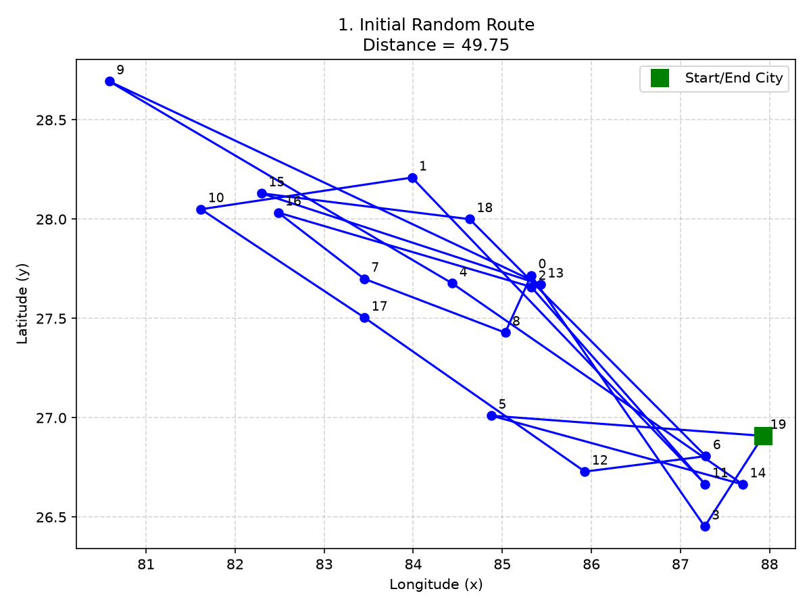
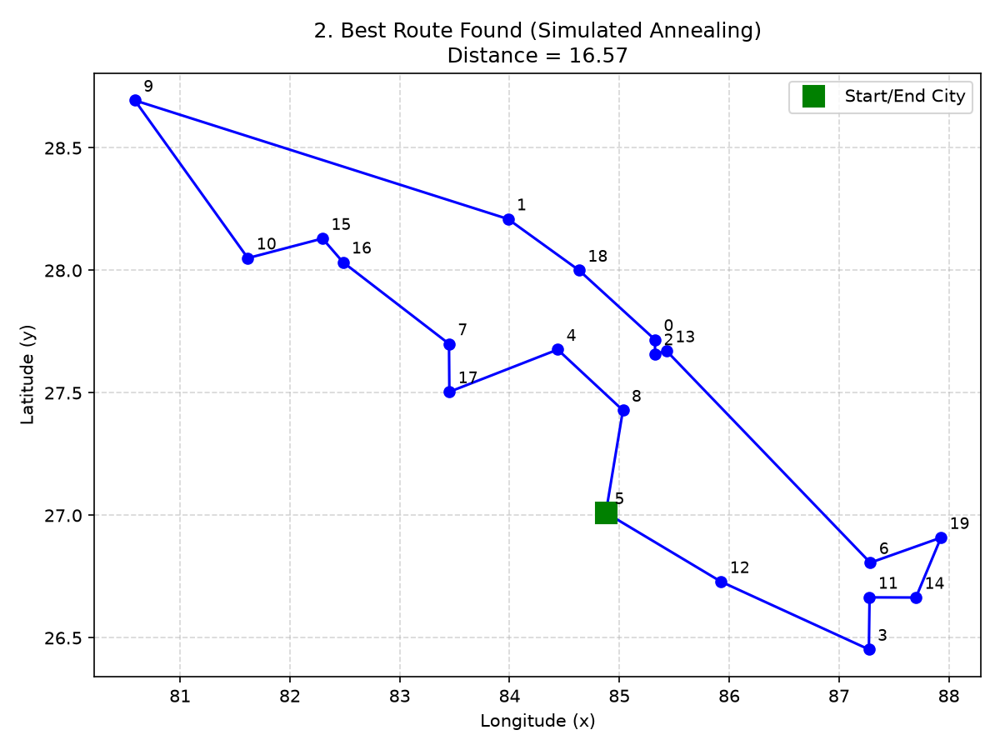
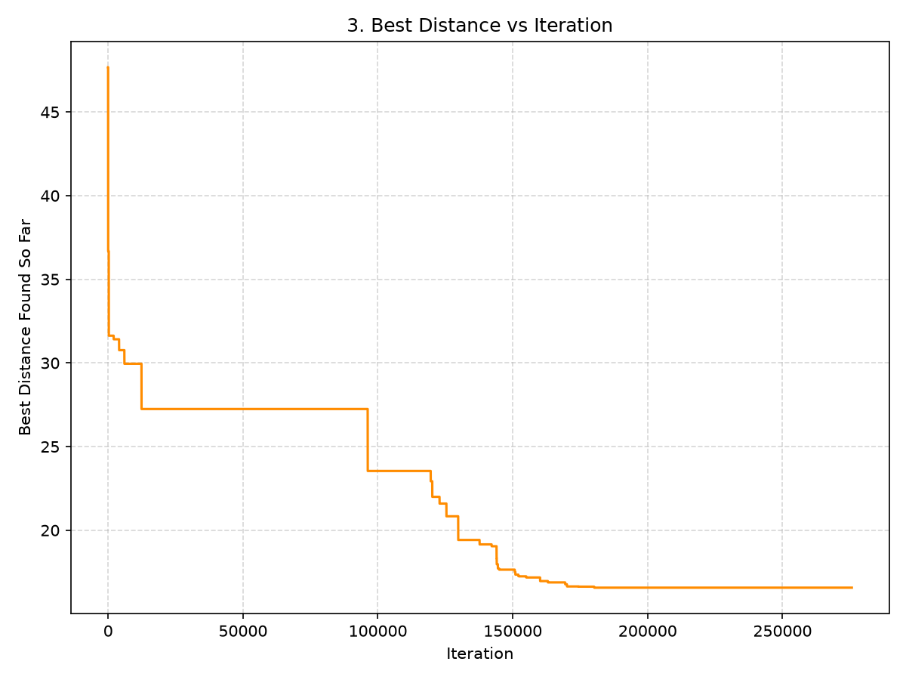
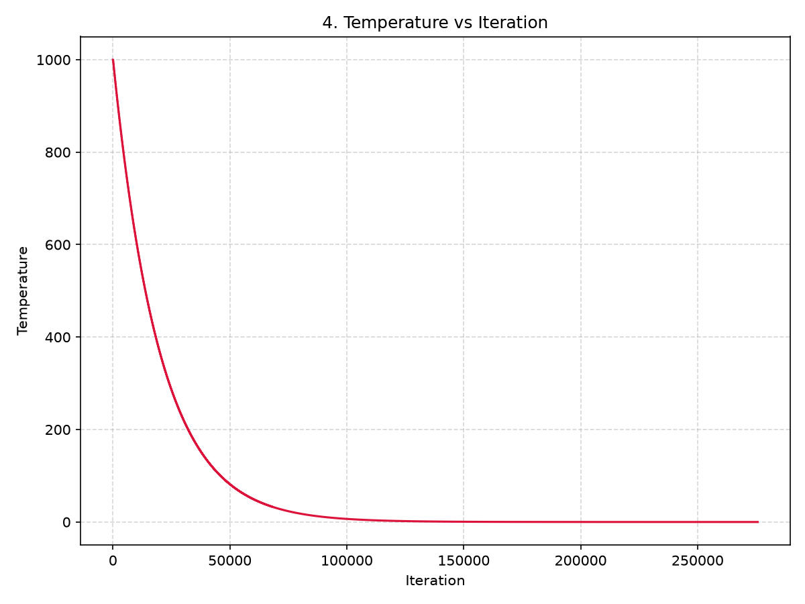
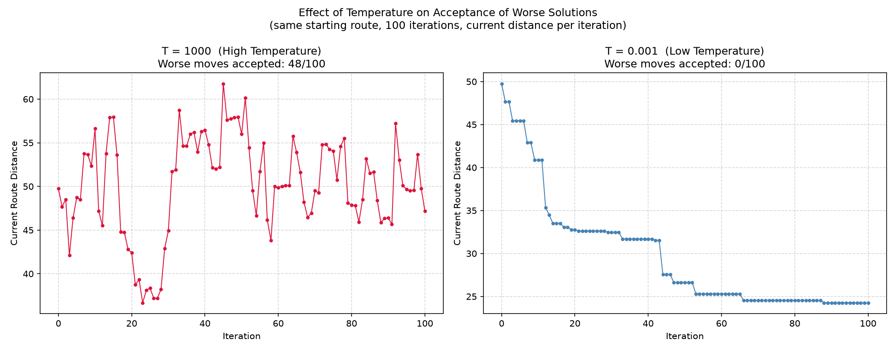

# Simulated Annealing TSP

A Python implementation of simulated annealing for solving a travelling salesperson problem using 20 cities in Nepal. The program compares an initial random route with the best route found and demonstrates how temperature affects acceptance of worse solutions.

## Folder Structure

```text
simulated_annealing/
├── .gitignore
├── README.md
└── main/
	└── main.py
```

## Requirements

- Python 3.9 or newer
- NumPy
- Matplotlib

## Setup

Create and activate a virtual environment, then install the dependencies:

```powershell
python -m venv venv
.\venv\Scripts\Activate.ps1
python -m pip install numpy matplotlib
```

## Run

From the project root:

```powershell
python main\main.py
```

The script prints route statistics and creates these generated plots in the current directory:

- `plot_1_initial_route.png`
- `plot_2_best_route.png`
- `plot_3_best_distance_vs_iteration.png`
- `plot_4_temperature_vs_iteration.png`
- `plot_5_temperature_acceptance_comparison.png`

The route coordinates are stored directly in `main/main.py`. Configuration values such as the cooling rate, temperature limits, and random seed can be adjusted near the top of that file.

## Results

The following plots show the optimization process and the effect of temperature on route selection.

### Initial Route

The randomly generated route before simulated annealing begins.



### Best Route

The shortest route discovered during the optimization process.



### Best Distance Over Time

The best distance decreases as the algorithm explores and improves candidate routes.



### Temperature Over Time

The cooling schedule gradually lowers the temperature throughout the run.



### Temperature Acceptance Comparison

At higher temperatures, worse routes are more likely to be accepted, helping the algorithm escape local optima.


